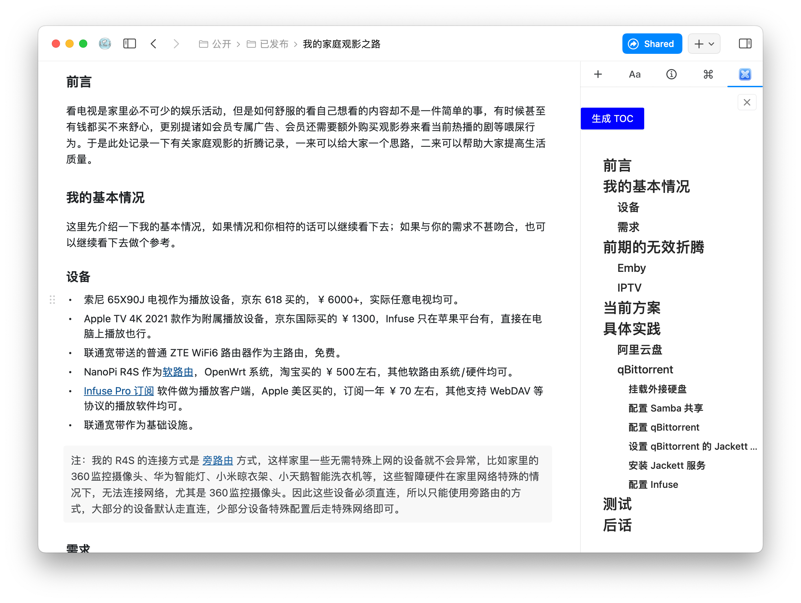

## 用途

有时候需要使用 heading 组织排版，但是写着写着就忘了父级是在第几级，此插件方便的查看当前文档的 heading 层级。

## 用法

因为 Craft 插件机制的限制，因此：
1. 无法实时检测文档变化
2. 无法在点击 toc 的时候，文档滚动到指定位置。
3. 可以做到点击 toc，将该 toc 当成是一个新页面打开，但是这应该不是大多数人的预期，所以没做。

你需要手动点击「生成 TOC」来手动生成 toc。
## 截图

## 开发

1. npm i
2. npm start
3. 打开浏览器 localhost:8080 查看（Craft 开发环境的默认文档内容无法检测，你需要该插件后获取数据然后调试）

## 打包

运行 `npm run build` 会在 `dist` 目录生成一个以后缀名 `.craftx` 命名的文件，此即为 Craft 插件。其他内容均为被打包到该插件中的内容

## 协议

不可商用，商用付费授权；个人随便用。
